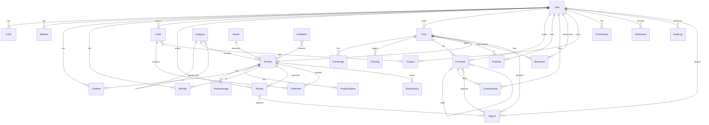

# 키즈공간 데이터 모델 설계서

> **작성 기준**: database-expert 스키마 명세서 형식 (Mermaid ERD, 컬럼 정의, 인덱스, 관계, 삭제 규칙, 예상 레코드 수)
> **관련 스킬**: database-expert, backend-expert, security-expert

---

## 1. ERD (Entity Relationship Diagram)



---

## 2. 스키마 명세

### 2.1 User (사용자)

| 항목 | 내용 |
|------|------|
| **테이블명** | users |
| **설명** | 사용자 정보 관리 (회원, 관리자) |
| **예상 레코드 수** | 100K+ |

#### 컬럼 정의

| 컬럼명 | 타입 | NULL | 기본값 | 설명 |
|--------|------|------|--------|------|
| id | String @id @default(cuid()) | NO | cuid | PK |
| email | String @unique | NO | - | 로그인 이메일 |
| password | String? | YES | null | bcrypt(cost=12) 해싱, 소셜 시 null |
| name | String | NO | - | 실명 |
| nickname | String @unique | NO | - | 닉네임 |
| phone | String? | YES | null | 휴대폰 번호 |
| profileImage | String? | YES | null | 프로필 이미지 URL |
| role | UserRole @default(USER) | NO | USER | USER, ADMIN, SUPER_ADMIN |
| grade | UserGrade @default(BRONZE) | NO | BRONZE | BRONZE, SILVER, GOLD, VIP |
| points | Int @default(0) | NO | 0 | 보유 포인트 |
| provider | AuthProvider @default(EMAIL) | NO | EMAIL | EMAIL, KAKAO, NAVER, GOOGLE |
| providerId | String? | YES | null | 소셜 로그인 고유 ID |
| agreeMarketing | Boolean @default(false) | NO | false | 마케팅 수신 동의 |
| status | UserStatus @default(ACTIVE) | NO | ACTIVE | ACTIVE, SUSPENDED, WITHDRAWN |
| loginFailCount | Int @default(0) | NO | 0 | 연속 로그인 실패 횟수 |
| lockedUntil | DateTime? | YES | null | 로그인 차단 해제 시간 |
| lastLoginAt | DateTime? | YES | null | 마지막 로그인 일시 |
| nicknameChangedAt | DateTime? | YES | null | 마지막 닉네임 변경일 |
| createdAt | DateTime @default(now()) | NO | now | 가입일 |
| updatedAt | DateTime @updatedAt | NO | auto | 수정일 |

#### 인덱스

| 인덱스명 | 컬럼 | 타입 | 용도 |
|----------|------|------|------|
| users_email_key | email | UNIQUE | 로그인, 중복 확인 |
| users_nickname_key | nickname | UNIQUE | 중복 확인 |
| users_provider_providerId | provider, providerId | COMPOUND | 소셜 로그인 조회 |
| users_status_createdAt | status, createdAt | COMPOUND | 회원 목록 관리 |

#### 관계

| 참조 테이블 | 관계 | FK 컬럼 | 삭제 규칙 |
|------------|------|---------|-----------|
| Child | 1:N | Child.userId | CASCADE |
| Address | 1:N | Address.userId | CASCADE |
| Order | 1:N | Order.userId | RESTRICT |
| CartItem | 1:N | CartItem.userId | CASCADE |
| Wishlist | 1:N | Wishlist.userId | CASCADE |
| Review | 1:N | Review.userId | CASCADE |
| Post | 1:N | Post.userId | CASCADE |
| Comment | 1:N | Comment.userId | CASCADE |
| Coupon | 1:N | Coupon.userId | CASCADE |
| PointHistory | 1:N | PointHistory.userId | CASCADE |
| Notification | 1:N | Notification.userId | CASCADE |
| Report | 1:N | Report.reporterId | CASCADE |

---

### 2.2 Child (자녀 정보)

| 항목 | 내용 |
|------|------|
| **테이블명** | children |
| **설명** | 사용자의 자녀 정보 (연령별 추천 연동) |
| **예상 레코드 수** | 200K+ |

#### 컬럼 정의

| 컬럼명 | 타입 | NULL | 기본값 | 설명 |
|--------|------|------|--------|------|
| id | String @id @default(cuid()) | NO | cuid | PK |
| userId | String | NO | - | FK → User |
| name | String? | YES | null | 자녀 이름/별명 |
| birthDate | DateTime | NO | - | 생년월일 |
| gender | Gender? | YES | null | MALE, FEMALE, UNSPECIFIED |
| createdAt | DateTime @default(now()) | NO | now | |
| updatedAt | DateTime @updatedAt | NO | auto | |

#### 관계

| 참조 테이블 | 관계 | FK 컬럼 | 삭제 규칙 |
|------------|------|---------|-----------|
| User | N:1 | userId | CASCADE (부모 삭제 시 함께 삭제) |

---

### 2.3 Address (배송지)

| 항목 | 내용 |
|------|------|
| **테이블명** | addresses |
| **설명** | 사용자 배송지 정보 |
| **예상 레코드 수** | 300K+ |

#### 컬럼 정의

| 컬럼명 | 타입 | NULL | 기본값 | 설명 |
|--------|------|------|--------|------|
| id | String @id @default(cuid()) | NO | cuid | PK |
| userId | String | NO | - | FK → User |
| label | String? | YES | null | 배송지명 (집, 회사 등) |
| recipientName | String | NO | - | 수령인 |
| phone | String | NO | - | 연락처 |
| zipCode | String | NO | - | 우편번호 |
| address | String | NO | - | 기본주소 |
| addressDetail | String? | YES | null | 상세주소 |
| isDefault | Boolean @default(false) | NO | false | 기본 배송지 여부 |
| createdAt | DateTime @default(now()) | NO | now | |
| updatedAt | DateTime @updatedAt | NO | auto | |

---

### 2.4 Category (카테고리)

| 항목 | 내용 |
|------|------|
| **테이블명** | categories |
| **설명** | 상품 카테고리 (3depth 셀프 참조) |
| **예상 레코드 수** | 100~ |

#### 컬럼 정의

| 컬럼명 | 타입 | NULL | 기본값 | 설명 |
|--------|------|------|--------|------|
| id | String @id @default(cuid()) | NO | cuid | PK |
| name | String | NO | - | 카테고리명 |
| slug | String @unique | NO | - | URL 슬러그 |
| description | String? | YES | null | 설명 |
| image | String? | YES | null | 카테고리 아이콘/이미지 URL |
| parentId | String? | YES | null | FK → Category (self, null이면 최상위) |
| depth | Int @default(0) | NO | 0 | 깊이 (0: 대분류, 1: 중분류, 2: 소분류) |
| sortOrder | Int @default(0) | NO | 0 | 정렬 순서 |
| isActive | Boolean @default(true) | NO | true | 활성 여부 |
| createdAt | DateTime @default(now()) | NO | now | |
| updatedAt | DateTime @updatedAt | NO | auto | |

#### 관계

| 참조 테이블 | 관계 | FK 컬럼 | 삭제 규칙 |
|------------|------|---------|-----------|
| Category (self) | N:1 | parentId | SET NULL |
| Product | 1:N | Product.categoryId | RESTRICT (상품 있으면 삭제 불가) |

---

### 2.5 Brand (브랜드)

| 항목 | 내용 |
|------|------|
| **테이블명** | brands |
| **설명** | 상품 브랜드 정보 |
| **예상 레코드 수** | 500+ |

#### 컬럼 정의

| 컬럼명 | 타입 | NULL | 기본값 | 설명 |
|--------|------|------|--------|------|
| id | String @id @default(cuid()) | NO | cuid | PK |
| name | String @unique | NO | - | 브랜드명 |
| slug | String @unique | NO | - | URL 슬러그 |
| logo | String? | YES | null | 로고 이미지 URL |
| description | String? | YES | null | 브랜드 설명 |
| isActive | Boolean @default(true) | NO | true | 활성 여부 |
| createdAt | DateTime @default(now()) | NO | now | |
| updatedAt | DateTime @updatedAt | NO | auto | |

---

### 2.6 Product (상품)

| 항목 | 내용 |
|------|------|
| **테이블명** | products |
| **설명** | 상품 정보 |
| **예상 레코드 수** | 10K+ |

#### 컬럼 정의

| 컬럼명 | 타입 | NULL | 기본값 | 설명 |
|--------|------|------|--------|------|
| id | String @id @default(cuid()) | NO | cuid | PK |
| name | String | NO | - | 상품명 |
| slug | String @unique | NO | - | URL 슬러그 |
| description | String @db.Text | NO | - | 상품 설명 (Sanitized HTML) |
| price | Int | NO | - | 정가 (원) |
| salePrice | Int? | YES | null | 할인가 (null이면 할인 없음) |
| categoryId | String | NO | - | FK → Category |
| brandId | String | NO | - | FK → Brand |
| ageGroup | AgeGroup? | YES | null | 적정 연령대 enum |
| thumbnail | String | NO | - | 대표 이미지 URL |
| stock | Int @default(0) | NO | 0 | 총 재고 |
| salesCount | Int @default(0) | NO | 0 | 누적 판매 수 |
| viewCount | Int @default(0) | NO | 0 | 조회수 |
| avgRating | Float @default(0) | NO | 0 | 평균 평점 (계산 필드) |
| reviewCount | Int @default(0) | NO | 0 | 리뷰 수 (계산 필드) |
| status | ProductStatus @default(ACTIVE) | NO | ACTIVE | ACTIVE, HIDDEN, SOLDOUT, DISCONTINUED |
| isFeatured | Boolean @default(false) | NO | false | 추천 상품 여부 |
| maxQuantity | Int @default(99) | NO | 99 | 최대 주문 수량 |
| shippingFee | Int @default(0) | NO | 0 | 개별 배송비 (0이면 기본 정책) |
| createdAt | DateTime @default(now()) | NO | now | |
| updatedAt | DateTime @updatedAt | NO | auto | |

#### 인덱스

| 인덱스명 | 컬럼 | 타입 | 용도 |
|----------|------|------|------|
| products_slug_key | slug | UNIQUE | URL 조회 |
| products_categoryId | categoryId | INDEX | 카테고리별 조회 |
| products_brandId | brandId | INDEX | 브랜드별 조회 |
| products_status_createdAt | status, createdAt | COMPOUND | 상품 목록 (활성 + 최신순) |
| products_status_salesCount | status, salesCount | COMPOUND | 인기순 정렬 |
| products_name | name | FULLTEXT | 상품 검색 |

#### 관계

| 참조 테이블 | 관계 | FK 컬럼 | 삭제 규칙 |
|------------|------|---------|-----------|
| Category | N:1 | categoryId | RESTRICT |
| Brand | N:1 | brandId | RESTRICT |
| ProductImage | 1:N | ProductImage.productId | CASCADE |
| ProductOption | 1:N | ProductOption.productId | CASCADE |
| CartItem | 1:N | CartItem.productId | CASCADE |
| Wishlist | 1:N | Wishlist.productId | CASCADE |
| Review | 1:N | Review.productId | CASCADE |
| OrderItem | 1:N | OrderItem.productId | RESTRICT |
| StockHistory | 1:N | StockHistory.productId | CASCADE |

---

### 2.7 ProductImage / ProductOption

#### ProductImage

| 컬럼명 | 타입 | NULL | 기본값 | 설명 |
|--------|------|------|--------|------|
| id | String @id @default(cuid()) | NO | cuid | PK |
| productId | String | NO | - | FK → Product (CASCADE) |
| url | String | NO | - | 이미지 URL |
| alt | String? | YES | null | 대체 텍스트 (접근성) |
| sortOrder | Int @default(0) | NO | 0 | 정렬 순서 |
| createdAt | DateTime @default(now()) | NO | now | |

#### ProductOption

| 컬럼명 | 타입 | NULL | 기본값 | 설명 |
|--------|------|------|--------|------|
| id | String @id @default(cuid()) | NO | cuid | PK |
| productId | String | NO | - | FK → Product (CASCADE) |
| name | String | NO | - | 옵션명 (예: "빨강 / M") |
| additionalPrice | Int @default(0) | NO | 0 | 추가 금액 |
| stock | Int @default(0) | NO | 0 | 옵션별 재고 |
| sku | String? @unique | YES | null | SKU 코드 |
| isActive | Boolean @default(true) | NO | true | 활성 여부 |
| createdAt | DateTime @default(now()) | NO | now | |
| updatedAt | DateTime @updatedAt | NO | auto | |

---

### 2.8 CartItem (장바구니)

| 항목 | 내용 |
|------|------|
| **테이블명** | cart_items |
| **예상 레코드 수** | 50K+ |
| **유니크 제약** | @@unique([userId, productId, optionId]) |

| 컬럼명 | 타입 | NULL | 기본값 | 설명 |
|--------|------|------|--------|------|
| id | String @id @default(cuid()) | NO | cuid | PK |
| userId | String | NO | - | FK → User (CASCADE) |
| productId | String | NO | - | FK → Product (CASCADE) |
| optionId | String | NO | - | FK → ProductOption |
| quantity | Int | NO | - | 수량 (1~maxQuantity) |
| createdAt | DateTime @default(now()) | NO | now | |
| updatedAt | DateTime @updatedAt | NO | auto | |

---

### 2.9 Order (주문)

| 항목 | 내용 |
|------|------|
| **테이블명** | orders |
| **설명** | 주문 정보 (결제, 배송, 취소/반품 포함) |
| **예상 레코드 수** | 500K+ |

#### 컬럼 정의

| 컬럼명 | 타입 | NULL | 기본값 | 설명 |
|--------|------|------|--------|------|
| id | String @id @default(cuid()) | NO | cuid | PK |
| orderNumber | String @unique | NO | - | 주문번호 (KS{yyyyMMdd}-{seq}) |
| userId | String | NO | - | FK → User (RESTRICT) |
| status | OrderStatus @default(PENDING) | NO | PENDING | 주문 상태 enum |
| totalAmount | Int | NO | - | 총 상품 금액 |
| discountAmount | Int @default(0) | NO | 0 | 할인 금액 |
| shippingFee | Int @default(0) | NO | 0 | 배송비 |
| pointUsed | Int @default(0) | NO | 0 | 사용 포인트 |
| finalAmount | Int | NO | - | 최종 결제 금액 |
| recipientName | String | NO | - | 수령인 |
| recipientPhone | String | NO | - | 수령인 연락처 |
| zipCode | String | NO | - | 우편번호 |
| address | String | NO | - | 배송 주소 |
| addressDetail | String? | YES | null | 상세 주소 |
| shippingMemo | String? | YES | null | 배송 메모 |
| paymentMethod | PaymentMethod | NO | - | 결제 수단 enum |
| paymentKey | String? | YES | null | PG사 결제 키 |
| paidAt | DateTime? | YES | null | 결제 완료 일시 |
| shippedAt | DateTime? | YES | null | 배송 시작 일시 |
| deliveredAt | DateTime? | YES | null | 배송 완료 일시 |
| confirmedAt | DateTime? | YES | null | 구매 확정 일시 |
| cancelledAt | DateTime? | YES | null | 취소 일시 |
| cancelReason | String? | YES | null | 취소 사유 |
| trackingNumber | String? | YES | null | 운송장 번호 |
| trackingCompany | String? | YES | null | 택배사 |
| couponId | String? | YES | null | FK → Coupon |
| createdAt | DateTime @default(now()) | NO | now | |
| updatedAt | DateTime @updatedAt | NO | auto | |

#### OrderStatus enum

```
PENDING, PAID, PREPARING, SHIPPED, DELIVERED, CONFIRMED,
CANCELLED, RETURN_REQUEST, RETURNED, EXCHANGE_REQUEST, EXCHANGED
```

#### 인덱스

| 인덱스명 | 컬럼 | 타입 | 용도 |
|----------|------|------|------|
| orders_orderNumber_key | orderNumber | UNIQUE | 주문번호 조회 |
| orders_userId_createdAt | userId, createdAt | COMPOUND | 사용자별 주문 목록 |
| orders_status_createdAt | status, createdAt | COMPOUND | 관리자 주문 관리 |

---

### 2.10 OrderItem (주문 상품)

| 컬럼명 | 타입 | NULL | 기본값 | 설명 |
|--------|------|------|--------|------|
| id | String @id @default(cuid()) | NO | cuid | PK |
| orderId | String | NO | - | FK → Order (CASCADE) |
| productId | String | NO | - | FK → Product (RESTRICT) |
| optionId | String? | YES | null | FK → ProductOption |
| productName | String | NO | - | 주문 시점 상품명 (스냅샷) |
| optionName | String? | YES | null | 주문 시점 옵션명 (스냅샷) |
| price | Int | NO | - | 주문 시점 단가 (스냅샷) |
| quantity | Int | NO | - | 수량 |
| totalPrice | Int | NO | - | 소계 (price × quantity) |
| createdAt | DateTime @default(now()) | NO | now | |

---

### 2.11 Review (리뷰)

| 항목 | 내용 |
|------|------|
| **테이블명** | reviews |
| **예상 레코드 수** | 200K+ |
| **유니크 제약** | @@unique([userId, productId]) |

| 컬럼명 | 타입 | NULL | 기본값 | 설명 |
|--------|------|------|--------|------|
| id | String @id @default(cuid()) | NO | cuid | PK |
| userId | String | NO | - | FK → User (CASCADE) |
| productId | String | NO | - | FK → Product (CASCADE) |
| orderId | String | NO | - | FK → Order |
| rating | Int | NO | - | 평점 (1~5) |
| content | String @db.Text | NO | - | 리뷰 내용 (Sanitized) |
| isPhotoReview | Boolean @default(false) | NO | false | 포토 리뷰 여부 |
| isBest | Boolean @default(false) | NO | false | 베스트 리뷰 |
| status | ReviewStatus @default(VISIBLE) | NO | VISIBLE | VISIBLE, HIDDEN, REPORTED |
| createdAt | DateTime @default(now()) | NO | now | |
| updatedAt | DateTime @updatedAt | NO | auto | |

- **ReviewImage**: id, reviewId(CASCADE), url, sortOrder, createdAt

---

### 2.12 Post (게시글)

| 항목 | 내용 |
|------|------|
| **테이블명** | posts |
| **예상 레코드 수** | 500K+ |

| 컬럼명 | 타입 | NULL | 기본값 | 설명 |
|--------|------|------|--------|------|
| id | String @id @default(cuid()) | NO | cuid | PK |
| userId | String | NO | - | FK → User (CASCADE) |
| boardSlug | String | NO | - | 게시판 slug |
| title | String | NO | - | 제목 |
| content | String @db.Text | NO | - | 본문 (Sanitized HTML) |
| viewCount | Int @default(0) | NO | 0 | 조회수 |
| likeCount | Int @default(0) | NO | 0 | 좋아요 수 (캐시) |
| commentCount | Int @default(0) | NO | 0 | 댓글 수 (캐시) |
| isPinned | Boolean @default(false) | NO | false | 상단 고정 |
| isBlinded | Boolean @default(false) | NO | false | 블라인드 |
| linkedProductId | String? | YES | null | FK → Product (SET NULL) |
| status | PostStatus @default(PUBLISHED) | NO | PUBLISHED | PUBLISHED, DRAFT, DELETED |
| createdAt | DateTime @default(now()) | NO | now | |
| updatedAt | DateTime @updatedAt | NO | auto | |

#### 인덱스

| 인덱스명 | 컬럼 | 타입 | 용도 |
|----------|------|------|------|
| posts_boardSlug_createdAt | boardSlug, createdAt | COMPOUND | 게시판별 최신순 목록 |
| posts_userId | userId | INDEX | 사용자별 게시글 |
| posts_boardSlug_likeCount | boardSlug, likeCount | COMPOUND | 인기글 조회 |

- **PostImage**: id, postId(CASCADE), url, sortOrder, createdAt
- **PostTag**: id, postId(CASCADE), tag

---

### 2.13 Comment (댓글)

| 컬럼명 | 타입 | NULL | 기본값 | 설명 |
|--------|------|------|--------|------|
| id | String @id @default(cuid()) | NO | cuid | PK |
| postId | String | NO | - | FK → Post (CASCADE) |
| userId | String | NO | - | FK → User (CASCADE) |
| parentId | String? | YES | null | FK → Comment (self, SET NULL) |
| content | String @db.Text | NO | - | 댓글 내용 (Sanitized) |
| likeCount | Int @default(0) | NO | 0 | 좋아요 수 |
| isDeleted | Boolean @default(false) | NO | false | 논리 삭제 |
| isAccepted | Boolean @default(false) | NO | false | Q&A 채택 여부 |
| createdAt | DateTime @default(now()) | NO | now | |
| updatedAt | DateTime @updatedAt | NO | auto | |

---

### 2.14 좋아요 / 북마크

#### PostLike @@unique([postId, userId])

| 컬럼명 | 타입 | 설명 |
|--------|------|------|
| id | String @id @default(cuid()) | PK |
| postId | String | FK → Post (CASCADE) |
| userId | String | FK → User (CASCADE) |
| createdAt | DateTime @default(now()) | |

#### CommentLike @@unique([commentId, userId])

| 컬럼명 | 타입 | 설명 |
|--------|------|------|
| id | String @id @default(cuid()) | PK |
| commentId | String | FK → Comment (CASCADE) |
| userId | String | FK → User (CASCADE) |
| createdAt | DateTime @default(now()) | |

#### Bookmark @@unique([postId, userId])

| 컬럼명 | 타입 | 설명 |
|--------|------|------|
| id | String @id @default(cuid()) | PK |
| postId | String | FK → Post (CASCADE) |
| userId | String | FK → User (CASCADE) |
| createdAt | DateTime @default(now()) | |

---

### 2.15 Coupon (쿠폰)

| 컬럼명 | 타입 | NULL | 기본값 | 설명 |
|--------|------|------|--------|------|
| id | String @id @default(cuid()) | NO | cuid | PK |
| userId | String | NO | - | FK → User (CASCADE) |
| name | String | NO | - | 쿠폰명 |
| code | String @unique | NO | - | 쿠폰 코드 |
| discountType | DiscountType | NO | - | PERCENT, AMOUNT |
| discountValue | Int | NO | - | 할인 값 |
| minOrderAmount | Int @default(0) | NO | 0 | 최소 주문 금액 |
| maxDiscountAmount | Int? | YES | null | 최대 할인 금액 (정률 시) |
| isUsed | Boolean @default(false) | NO | false | 사용 여부 |
| usedAt | DateTime? | YES | null | 사용 일시 |
| expiresAt | DateTime | NO | - | 만료일 |
| createdAt | DateTime @default(now()) | NO | now | |

---

### 2.16 PointHistory (포인트 이력)

| 컬럼명 | 타입 | NULL | 기본값 | 설명 |
|--------|------|------|--------|------|
| id | String @id @default(cuid()) | NO | cuid | PK |
| userId | String | NO | - | FK → User (CASCADE) |
| type | PointType | NO | - | EARN, USE, EXPIRE, ADMIN |
| amount | Int | NO | - | 금액 (양수: 적립, 음수: 사용) |
| balance | Int | NO | - | 변동 후 잔액 |
| description | String | NO | - | 설명 |
| relatedOrderId | String? | YES | null | 관련 주문 ID |
| createdAt | DateTime @default(now()) | NO | now | |

---

### 2.17 Notification (알림)

| 컬럼명 | 타입 | NULL | 기본값 | 설명 |
|--------|------|------|--------|------|
| id | String @id @default(cuid()) | NO | cuid | PK |
| userId | String | NO | - | FK → User (CASCADE) |
| type | NotificationType | NO | - | ORDER_STATUS, COMMENT, COMMENT_REPLY, LIKE, COUPON, POINT, SYSTEM, EVENT |
| title | String | NO | - | 알림 제목 |
| message | String | NO | - | 알림 내용 |
| link | String? | YES | null | 클릭 시 이동 URL |
| isRead | Boolean @default(false) | NO | false | 읽음 여부 |
| createdAt | DateTime @default(now()) | NO | now | |

#### 인덱스

| 인덱스명 | 컬럼 | 타입 | 용도 |
|----------|------|------|------|
| notifications_userId_isRead_createdAt | userId, isRead, createdAt | COMPOUND | 사용자별 읽지 않은 알림 |

---

### 2.18 Exhibition (기획전) & Banner (배너)

#### Exhibition

| 컬럼명 | 타입 | NULL | 기본값 | 설명 |
|--------|------|------|--------|------|
| id | String @id @default(cuid()) | NO | cuid | PK |
| title | String | NO | - | 기획전 제목 |
| slug | String @unique | NO | - | URL 슬러그 |
| description | String? @db.Text | YES | null | 설명 |
| bannerImage | String | NO | - | 배너 이미지 URL |
| startDate | DateTime | NO | - | 시작일 |
| endDate | DateTime | NO | - | 종료일 |
| isActive | Boolean @default(true) | NO | true | 활성 여부 |
| sortOrder | Int @default(0) | NO | 0 | 정렬 순서 |
| createdAt | DateTime @default(now()) | NO | now | |
| updatedAt | DateTime @updatedAt | NO | auto | |

- M:N 관계: ExhibitionProduct (exhibitionId, productId) 중간 테이블

#### Banner

| 컬럼명 | 타입 | NULL | 기본값 | 설명 |
|--------|------|------|--------|------|
| id | String @id @default(cuid()) | NO | cuid | PK |
| title | String | NO | - | 배너 제목 |
| imageUrl | String | NO | - | 이미지 URL |
| mobileImageUrl | String? | YES | null | 모바일 이미지 URL |
| linkUrl | String? | YES | null | 클릭 시 이동 URL |
| position | BannerPosition | NO | - | MAIN_HERO, MAIN_MIDDLE, SHOP_TOP |
| sortOrder | Int @default(0) | NO | 0 | 정렬 순서 |
| startDate | DateTime | NO | - | 노출 시작일 |
| endDate | DateTime | NO | - | 노출 종료일 |
| isActive | Boolean @default(true) | NO | true | 활성 여부 |
| createdAt | DateTime @default(now()) | NO | now | |
| updatedAt | DateTime @updatedAt | NO | auto | |

---

### 2.19 Notice / FAQ / AuditLog

#### Notice (공지사항)

| 컬럼명 | 타입 | 설명 |
|--------|------|------|
| id, title, content(@db.Text), isPinned, viewCount, createdAt, updatedAt | | |

#### FAQ

| 컬럼명 | 타입 | 설명 |
|--------|------|------|
| id, category, question, answer(@db.Text), sortOrder, isActive, createdAt, updatedAt | | |

#### AuditLog (감사 로그) — security-expert 요구사항

| 컬럼명 | 타입 | NULL | 기본값 | 설명 |
|--------|------|------|--------|------|
| id | String @id @default(cuid()) | NO | cuid | PK |
| userId | String | NO | - | 수행한 관리자 ID |
| action | String | NO | - | CREATE, UPDATE, DELETE |
| entity | String | NO | - | 대상 엔티티명 |
| entityId | String | NO | - | 대상 엔티티 ID |
| changes | Json? | YES | null | 변경 내용 {before, after} |
| ipAddress | String? | YES | null | 요청 IP |
| userAgent | String? | YES | null | 요청 User-Agent |
| createdAt | DateTime @default(now()) | NO | now | |

#### 인덱스

| 인덱스명 | 컬럼 | 타입 | 용도 |
|----------|------|------|------|
| audit_logs_userId_createdAt | userId, createdAt | COMPOUND | 관리자별 행위 이력 |
| audit_logs_entity_entityId | entity, entityId | COMPOUND | 엔티티별 변경 이력 |

---

### 2.20 Report (신고)

| 항목 | 내용 |
|------|------|
| **테이블명** | reports |
| **설명** | 게시글/댓글/리뷰 신고 관리 (3건 접수 시 자동 블라인드) |
| **예상 레코드 수** | 10K+ |

#### 컬럼 정의

| 컬럼명 | 타입 | NULL | 기본값 | 설명 |
|--------|------|------|--------|------|
| id | String @id @default(cuid()) | NO | cuid | PK |
| reporterId | String | NO | - | FK → User (신고자) |
| targetType | ReportTargetType | NO | - | POST, COMMENT, REVIEW |
| targetId | String | NO | - | 신고 대상 ID |
| reason | ReportReason | NO | - | 신고 사유 enum |
| description | String? | YES | null | 상세 사유 |
| status | ReportStatus @default(PENDING) | NO | PENDING | PENDING, REVIEWED, DISMISSED |
| processedAt | DateTime? | YES | null | 처리 일시 |
| processedBy | String? | YES | null | 처리 관리자 ID |
| createdAt | DateTime @default(now()) | NO | now | |

#### 인덱스

| 인덱스명 | 컬럼 | 타입 | 용도 |
|----------|------|------|------|
| reports_targetType_targetId | targetType, targetId | COMPOUND | 대상별 신고 조회 |
| reports_status_createdAt | status, createdAt | COMPOUND | 미처리 신고 관리 |
| reports_reporterId_targetType_targetId | reporterId, targetType, targetId | UNIQUE | 중복 신고 방지 |

---

### 2.21 StockHistory (재고 이력)

| 항목 | 내용 |
|------|------|
| **테이블명** | stock_histories |
| **설명** | 상품/옵션별 재고 변동 이력 (입고, 출고, 조정, 반품) |
| **예상 레코드 수** | 500K+ |

#### 컬럼 정의

| 컬럼명 | 타입 | NULL | 기본값 | 설명 |
|--------|------|------|--------|------|
| id | String @id @default(cuid()) | NO | cuid | PK |
| productId | String | NO | - | FK → Product |
| optionId | String? | YES | null | FK → ProductOption (null이면 총재고) |
| type | StockChangeType | NO | - | IN, OUT, ADJUST, RETURN |
| quantity | Int | NO | - | 변동 수량 (양수: 증가, 음수: 감소) |
| beforeStock | Int | NO | - | 변동 전 재고 |
| afterStock | Int | NO | - | 변동 후 재고 |
| reason | String | NO | - | 변동 사유 |
| relatedOrderId | String? | YES | null | 관련 주문 ID |
| createdBy | String | NO | - | 수행자 ID (관리자 또는 시스템) |
| createdAt | DateTime @default(now()) | NO | now | |

#### 인덱스

| 인덱스명 | 컬럼 | 타입 | 용도 |
|----------|------|------|------|
| stock_histories_productId_createdAt | productId, createdAt | COMPOUND | 상품별 이력 조회 |
| stock_histories_optionId | optionId | INDEX | 옵션별 이력 조회 |

---

### 2.22 SearchKeyword (검색 키워드)

| 항목 | 내용 |
|------|------|
| **테이블명** | search_keywords |
| **설명** | 인기 검색어 집계용 테이블 |
| **예상 레코드 수** | 100K+ |

#### 컬럼 정의

| 컬럼명 | 타입 | NULL | 기본값 | 설명 |
|--------|------|------|--------|------|
| id | String @id @default(cuid()) | NO | cuid | PK |
| keyword | String | NO | - | 검색 키워드 (정규화) |
| count | Int @default(1) | NO | 1 | 검색 횟수 |
| lastSearchedAt | DateTime @default(now()) | NO | now | 마지막 검색 시각 |
| createdAt | DateTime @default(now()) | NO | now | |

#### 인덱스

| 인덱스명 | 컬럼 | 타입 | 용도 |
|----------|------|------|------|
| search_keywords_keyword_key | keyword | UNIQUE | 중복 방지 |
| search_keywords_count | count | INDEX (DESC) | 인기 검색어 조회 |

---

## 3. Enum 정의

```prisma
enum UserRole { USER ADMIN SUPER_ADMIN }
enum UserGrade { BRONZE SILVER GOLD VIP }
enum UserStatus { ACTIVE SUSPENDED WITHDRAWN }
enum AuthProvider { EMAIL KAKAO NAVER GOOGLE }
enum Gender { MALE FEMALE UNSPECIFIED }
enum AgeGroup { AGE_0_6M AGE_6_12M AGE_1_2 AGE_3_5 AGE_6_8 AGE_9_PLUS }
enum ProductStatus { ACTIVE HIDDEN SOLDOUT DISCONTINUED }
enum OrderStatus { PENDING PAID PREPARING SHIPPED DELIVERED CONFIRMED CANCELLED RETURN_REQUEST RETURNED EXCHANGE_REQUEST EXCHANGED }
enum PaymentMethod { CARD BANK_TRANSFER KAKAO_PAY NAVER_PAY TOSS_PAY }
enum DiscountType { PERCENT AMOUNT }
enum PointType { EARN USE EXPIRE ADMIN }
enum ReviewStatus { VISIBLE HIDDEN REPORTED }
enum PostStatus { PUBLISHED DRAFT DELETED }
enum NotificationType { ORDER_STATUS COMMENT COMMENT_REPLY LIKE COUPON POINT SYSTEM EVENT }
enum BannerPosition { MAIN_HERO MAIN_MIDDLE SHOP_TOP }
enum ReportTargetType { POST COMMENT REVIEW }
enum ReportReason { SPAM ABUSE INAPPROPRIATE MISINFORMATION OTHER }
enum ReportStatus { PENDING REVIEWED DISMISSED }
enum StockChangeType { IN OUT ADJUST RETURN }
```

---

## 4. 데이터 보안 정책

> **근거**: security-expert, database-expert 보안 요구사항

| 정책 | 적용 대상 | 방법 |
|------|-----------|------|
| 비밀번호 해싱 | User.password | bcrypt(cost=12) |
| 개인정보 암호화 | phone, address 등 | 애플리케이션 레벨 AES-256-GCM (Phase 2) |
| 개인정보 마스킹 | API 응답 시 | 010-****-5678, k***@email.com |
| 소프트 삭제 | User(WITHDRAWN), Post(DELETED), Comment(isDeleted) | status/flag 변경 |
| 감사 로그 | 관리자 모든 CUD 작업 | AuditLog 테이블 자동 기록 |
| 접근 제어 | 본인 데이터만 조회/수정 | Middleware + Repository WHERE 조건 |
| SQL 인젝션 방지 | 모든 쿼리 | Prisma Parameterized Query |
