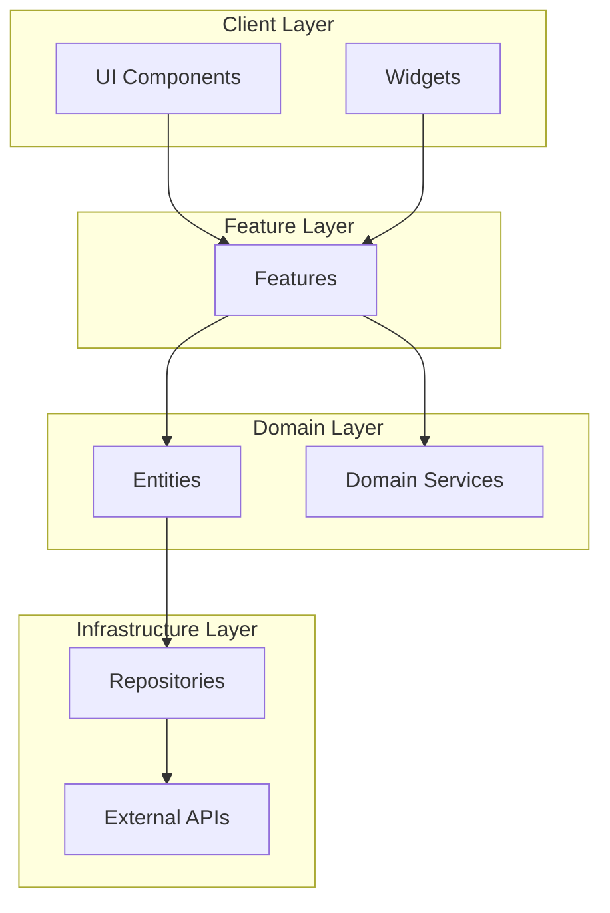

# Architecture Review Skill (아키텍처 검토)

## 역할
- 아키텍처 원칙 준수 검증 (SOLID, DRY, KISS, YAGNI)
- 기술 스택 평가
- 확장성/유지보수성 분석
- 안티패턴 탐지 및 개선 가이드
- 리팩토링 우선순위 제안

## 파라미터
- `currentArchitecture` (string, required): 현재 아키텍처 설명 (마크다운/텍스트)
- `techStack` (object, optional): { frontend, backend, database, infrastructure }
- `knownIssues` (array, optional): 현재 인지하고 있는 문제점 목록
- `scale` (string, optional): 'startup', 'medium', 'enterprise', 기본값 'medium'

## 의존성
- `domain-modeling` (선행 권장)
- `fsd-structuring` (선행 권장)

## 출력
```typescript
{
  reviewReport: {
    overallScore: 75,  // 0-100
    grades: {
      modularity: 'A',      // 모듈화
      testability: 'B',     // 테스트 용이성
      scalability: 'B',     // 확장성
      maintainability: 'A', // 유지보수성
      performance: 'C'      // 성능
    },
    violations: [
      {
        principle: 'SRP',
        severity: 'HIGH',
        location: 'src/features/auth/useAuth.ts:45',
        description: 'useAuth 훅이 200라인 이상, 단일 책임 위반',
        suggestion: '도메인 로직을 service로 분리'
      }
    ],
    improvementPriorities: [
      {
        priority: 1,
        title: 'useAuth 리팩토링',
        effort: 'medium',
        impact: 'high',
        steps: [...]
      }
    ]
  },
  recommendations: {
    immediate: [...],   // 즉시 적용 (1-2주)
    shortTerm: [...],   // 단기 (1-3개월)
    longTerm: [...]     // 장기 (6개월 이상)
  },
  antiPatternsDetected: [
    {
      name: 'God Object',
      location: 'src/shared/lib/utils.ts',
      description: 'Utility 파일에 모든 함수 집중',
      fix: '기능별로 분리 (format, validation, api)'
    }
  ],
  bestPractices: [
    '도메인 로직은 entities/에 위치',
    '비즈니스 로직은 features/나 entities/에만',
    '의존성 방향: 상위 레이어 → 하위 레이어만'
  ],
  diagrams: {
    currentArchitecture: '현재 구조 다이어그램 (Mermaid)',
    proposedArchitecture: '제안 구조 다이어그램'
  }
}
```

## 사용 예시
"현재 Next.js + Prisma 아키텍처 검토해줘" → currentArchitecture로 구조 설명 전달

## 검토 체크리스트

### SOLID 원칙
- [ ] **SRP (Single Responsibility)**: 각 클래스/모듈이 단일 책임
- [ ] **OCP (Open/Closed)**: 확장은 열려있고 수정은 닫혀있음
- [ ] **LSP (Liskov Substitution)**: 하위 타입은 상위 타입으로 대체 가능
- [ ] **ISP (Interface Segregation)**: 인터페이스 분리, 클라이언트에 맞춤
- [ ] **DIP (Dependency Inversion)**: 상위 모듈이 하위에 의존하지 않음

### DRY/KISS/YAGNI
- [ ] **DRY**: 중복 코드 없음
- [ ] **KISS**: 단순한 해결책
- [ ] **YAGNI**: 필요 없는 기능/코드 없음

### 아키텍처 원칙
- [ ] **Clean Architecture**: 레이어 분리 명확
- [ ] **점진적 개선**: 한 번에 전체 바꾸기 금지
- [ ] **테스트 용이성**: 도메인 로직 테스트 가능

## 코드 냄새 (Code Smells) 감지

### 1. God Object
```typescript
// 나쁜 예: 한 클래스가 모든 일을 함
class OrderService {
  // 500라인...
  createOrder() { /* ... */ }
  calculateTax() { /* ... */ }
  sendEmail() { /* ... */ }
  generatePdf() { /* ... */ }
  updateInventory() { /* ... */ }
}

// 좋은 예: 역할 분리
class OrderCreator { /* ... */ }
class TaxCalculator { /* ... */ }
class EmailSender { /* ... */ }
```

### 2. Feature Envy
```typescript
// 나쁜 예: Order가 OrderItem 데이터에 너무 의존
class Order {
  getTotal(): number {
    // OrderItem의 price, quantity 직접 접근
    return this.items.reduce((sum, item) => 
      sum + item.price * item.quantity, 0);
  }
}

// 좋은 예: OrderItem이 자신의 total 계산
class OrderItem {
  getTotal(): number {
    return this.price * this.quantity;
  }
}
```

### 3. Long Parameter List
```typescript
// 나쁜 예
function createOrder(
  customerId, productId, quantity, address, 
  couponCode, shippingMethod, giftWrap, note
) { /* ... */ }

// 좋은 예: Value Object or Builder
function createOrder(params: CreateOrderParams) { /* ... */ }
```

### 4. Shotgun Surgery
```typescript
// 나쁜 예: 가격 변경 시 10군데 수정 필요
// Product, Order, Invoice, Receipt, Report, ...

// 좋은 예: Money Value Object로 통일
class Money { /* ... */ }  // 한 곳만 수정
```

### 5. Primitive Obsession
```typescript
// 나쁜 예: string, number primitive만 사용
const email = "user@example.com";  // 검증 없음
const price = 10000;               // 통화 없음

// 좋은 예: Value Object
const email = new Email("user@example.com");
const price = new Money(10000, 'KRW');
```

### 6. Switch Statements
```typescript
// 나쁜 예: switch로 타입 검사
function handleOrder(state: OrderState) {
  switch (state) {
    case 'pending': /* ... */ break;
    case 'paid': /* ... */ break;
    case 'shipped': /* ... */ break;
  }
}

// 좋은 예: 다형성
abstract class OrderState {
  abstract handle(): void;
}
class PendingState extends OrderState { /* ... */ }
class PaidState extends OrderState { /* ... */ }
```

## 리팩토링 우선순위

1. **즉시 (Critical)**:
   - Import cycle
   - Security vulnerability
   - Data corruption risk

2. **단기 (High)**:
   - God object 분리
   - 테스트 용이성 향상
   - API 안정화

3. **중기 (Medium)**:
   - Primitive obsession 해결
   - Switch statement → 다형성
   - Exception handling 표준화

4. **장기 (Low)**:
   - 성능 최적화
   - Documentation 개선
   - Deprecated code 정리

## 성능 평가

### measurable metrics
- **Build time**: `npm run build` 시간
- **Test coverage**: `jest --coverage` 결과
- **Bundle size**: `next build` output 분석
- **LCP/FID**: Lighthouse 점수

### 권고사항
- 번들 사이즈 200KB 초과 → Code splitting
- 테스트 커버리지 70% 미만 → 테스트 작성 강조
- Build time 5분 초과 → 병렬화, 캐싱

## 기술 스택 평가

```typescript
{
  "frontend": {
    "nextjs": { rating: "A", reason: "SSR/SSG 최적화, App Router 지원" },
    "react": { rating: "A", reason: "컴포넌트 모델 우수" },
    "typescript": { rating: "A", reason: "정적 타입 안정성" }
  },
  "backend": {
    "nodejs": { rating: "B", reason: "JavaScript 싱글스레드 한계" },
    "prisma": { rating: "A", reason: "Type-safe ORM" }
  },
  "testing": {
    "jest": { rating: "A", reason: "Feature-rich, snapshot testing" },
    "testing-library": { rating: "A", reason: "사용자 중심 테스트" }
  }
}
```

## 다이어그램 생성

### Mermaid 기반 아키텍처 다이어그램


## 점진적 개선 계획

### Week 1-2: 긴급 조치
- Import cycle 제거
- Critical code smell 해결
- 테스트 환경 구축

### Week 3-4: 단기 개선
- FSD 구조 도입 (point-wise)
- 도메인 모델 정리
- Public API 설계

### Month 2-3: 중기 개선
- 전체 FSD 마이그레이션
- TDD 워크플로우 정착
- 문서화 강화

### Month 4-6: 장기 개선
- 모놀리ths → 모듈화 고려
- 모니터링/로깅 개선
- 성능 최적화

## 보고서 출력

```markdown
# 아키텍처 검토 보고서

##Overall Grade: B+ (75/100)

###강점
- TypeScript 엄격 모드 활성화
- 컴포넌트 단순성 유지
- 일관된 네이밍 컨벤션

###개선 필요
1. SRP 위반 (useAuth 훅 200라인)
2. Import cycle (entities → features → entities)
3. 테스트 커버리지 45% (목표 80%)

###우선순위별 권고

####High Priority
- [ ] useAuth 리팩토링 (SRP)
- [ ] Import cycle 해결
- [ ] 테스트 커버리지 70% 이상

####Medium Priority
- [ ] Primitive obsession → Value Objects
- [ ] Switch statement 제거
- [ ] Error handling 표준화

####Low Priority
- [ ] 번들 최적화
- [ ] 문서화 보강
- [ ] ESLint 규칙 강화
```