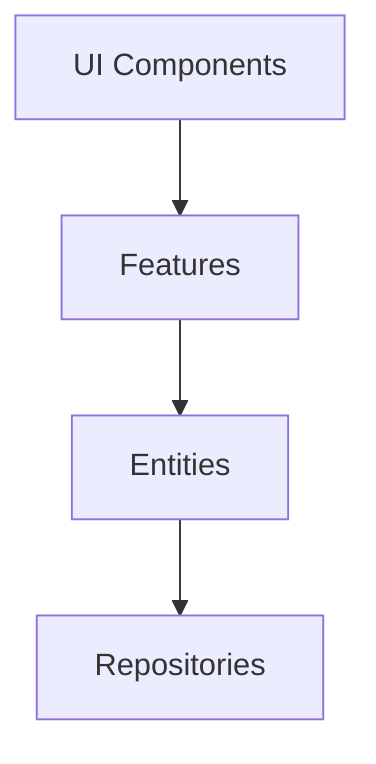
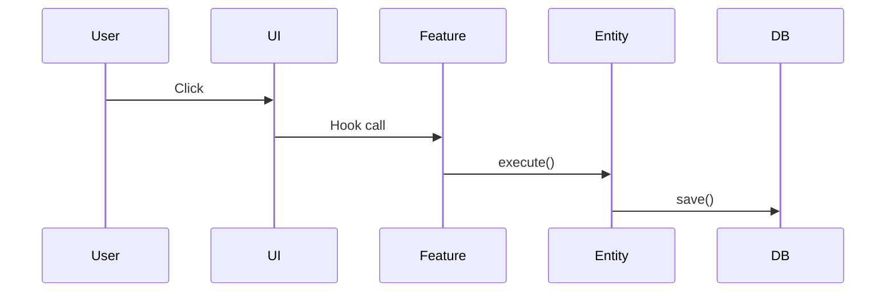
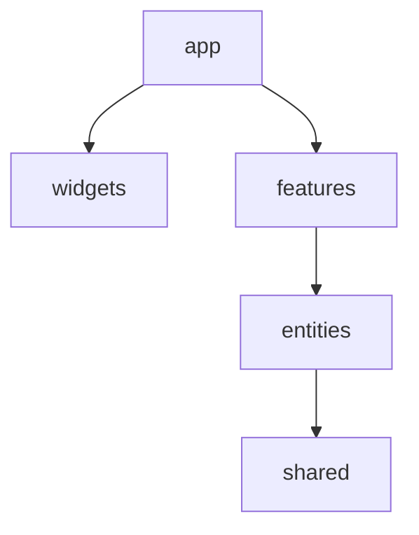

# Documentation Skill (아키텍처 문서화)

## 역할
- 아키텍처 의사결정 기록 (ADR) 작성
- API 문서 자동화 템플릿 제공
- 다이어그램 생성 (Mermaid, PlantUML)
- README 및 Technical Documentation 작성 가이드

## 파라미터
- `docType` (string, required): 'adr' | 'api' | 'architecture' | 'readme'
- `decisions` (array, optional): 의사결정 사항 배열
- `includeDiagrams` (boolean, optional): 다이어그램 포함, 기본값 true
- `format` (string, optional): 'markdown' | 'html', 기본값 'markdown'

## 의존성
- `architecture-review`
- `fsd-structuring`

## 출력
```typescript
{
  document: { title, content, metadata },
  diagrams: { architecture, flow, directory },
  templates: { adr, api, readme, architecture },
  examples: { completedADR, apiSpec, diagramTemplates }
}
```

## 사용 예시
"이커머스 아키텍처 의사결정 기록(ADR) 작성해줘"

## ADR 템플릿

```markdown
# ADR 001: FSD 아키텍처 채택

## 상태
✅ Accepted

## contexte
[배경 설명]

## 결정
[결정 내용]

## 이유
- 장점 1
- 장점 2

## 영향
- 영향 1
- 영향 2

## 거부된 대안
1. 대안 A
   - 단점: ...

## 시험 계획
- 2주간 PoC

## 참고
- [링크](https://...)
```

## Mermaid 다이어그램

### 컴포넌트 다이어그램


### 시퀀스 다이어그램


### 디렉토리 구조


## API 문서 (OpenAPI)

```yaml
openapi: 3.0.0
info:
  title: API 제목
  version: 1.0.0
paths:
  /api/v1/orders:
    post:
      summary: 주문 생성
      requestBody:
        content:
          application/json:
            schema:
              $ref: '#/components/schemas/Order'
      responses:
        '201':
          description: 생성됨
```

## README 템플릿

```markdown
# 프로젝트명

## 개요
한 줄 설명

## 기술 스택
- Next.js, TypeScript, Prisma

## 아키텍처
[다이어그램]

### FSD 구조
```
src/
├── app/
├── features/
├── entities/
└── shared/
```

##快速 시작
```bash
npm install && npm run dev
```

##품질 게이트
- ESLint + Prettier
- Test coverage ≥ 80%
```

## 모범 사례

1. **ADR**: 한 결정 = 한 문서, 1-2페이지
2. **Mermaid**: 버전 관리-friendly, 텍스트 기반
3. **자동화**: Swagger, GitHub Pages
4. **팀 공유**: PR 템플릿에 ADR 링크

## 도구

- ADR CLI: `npx adr create "결정"`
- Mermaid VS Code 확장
- Swagger UI
- GitHub Pages / Vercel

## 체크리스트
- [ ] 모든 기술 결정 ADR화
- [ ] Mermaid 다이어그램 포함
- [ ] README 최신 상태
- [ ] API 문서 자동화
- [ ] 문서 배포 자동화

## 참고
- [ADR 가이드](https://adr.github.io/)
- [Mermaid](https://mermaid.js.org/)
- [OpenAPI](https://www.openapis.org/)