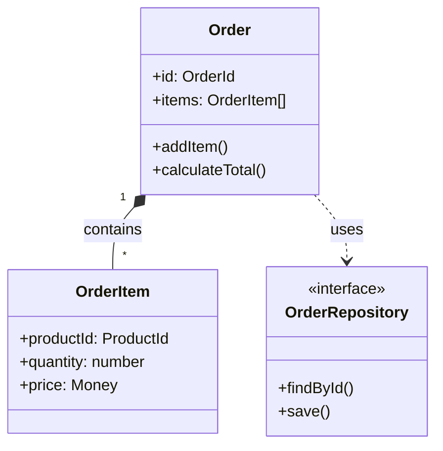

# Domain Modeling Skill (DDD 도메인 모델링)

## 역할
- 엔티티, 밸류 객체, 애그리거트 설계
- 유비쿼터스 언어 정의
- 바운디드 컨텍스트 분리
- 리포지토리/도메인 서비스 패턴

## 파라미터
- `domain` (string, required): 'ecommerce', 'saas', 'fintech', 'healthcare'
- `aggregates` (array, optional): 초기 애그리거트 목록
- `useCQRS` (boolean, optional): CQRS 적용 여부, 기본값 false
- `useEventSourcing` (boolean, optional): Event Sourcing 적용 여부, 기본값 false

## 의존성
없음 (독립적)

## 출력
```typescript
{
  domainModel: {
    boundedContexts: [
      {
        name: 'Order',
        description: '주문 컨텍스트',
        aggregates: [
          {
            name: 'Order',
            root: true,
            entities: [...],
            valueObjects: [...],
            domainEvents: [...]
          }
        ],
        repositories: ['OrderRepository'],
        domainServices: ['PricingService']
      }
    ],
    ubiquitousLanguage: {
      terms: {
        '주문': '고객이 상품을 구매하는 행위',
        '주문항목': '주문에 포함된 개별 상품',
        // ...
      }
    }
  },
  codeExamples: {
    entity: 'TypeScript 예제',
    valueObject: 'TypeScript 예제',
    aggregate: 'TypeScript 예제',
    repository: '인터페이스 + 구현체',
    domainService: 'TypeScript 예제',
    domainEvent: 'TypeScript 예제'
  },
  patterns: {
    suggested: ['Aggregate', 'Repository', 'Domain Event'],
    avoid: ['Fat Entity', 'Anemic Domain Model']
  }
}
```

## 사용 예시
"이커머스 주문 시스템을 DDD로 설계해줘" → domain='ecommerce', aggregates=['Order', 'Product', 'Customer']

## 핵심 개념

### 1. 엔티티 (Entity)
```typescript
class Order {
  readonly id: OrderId;  // 식별자
  private items: OrderItem[] = [];
  
  // 비즈니스 로직 (도메인 규칙)
  addItem(product: Product, quantity: number): void {
    if (quantity <= 0) throw new Error('Invalid quantity');
    this.items.push(new OrderItem(product, quantity));
    this.registerEvent(new OrderItemAddedEvent(this.id, product.id));
  }
}
```

### 2. 밸류 객체 (Value Object)
```typescript
class Money {
  constructor(
    private readonly amount: number,
    private readonly currency: string
  ) {}
  
  add(other: Money): Money {
    if (this.currency !== other.currency) throw new Error('Currency mismatch');
    return new Money(this.amount + other.amount, this.currency);
  }
  
  // 밸류 객체는 equals() 오버라이드
  equals(other: Money): boolean {
    return this.amount === other.amount && this.currency === other.currency;
  }
}
```

### 3. 애그리거트 (Aggregate)
```typescript
class OrderAggregate {
  private order: Order;
  private orderItems: OrderItem[];
  
  // 모든 변경은 애그리거트 루트를 통해
  addItem(product: Product, quantity: number): void {
    this.ensureStockAvailable(product, quantity);
    this.order.addItem(product, quantity);
    this.ensureOrderTotalWithinLimit();
  }
  
  // 불변성 보장
  // ...
}
```

### 4. 리포지토리 (Repository)
```typescript
interface OrderRepository {
  findById(id: OrderId): Promise<Order | null>;
  save(order: Order): Promise<void>;
  findByCustomer(customerId: CustomerId): Promise<Order[]>;
}

// 구현체는 인프라스트럭처 레이어
class PrismaOrderRepository implements OrderRepository {
  async findById(id: OrderId): Promise<Order | null> {
    const data = await prisma.order.findUnique({ where: { id } });
    return data ? this.toDomain(data) : null;
  }
}
```

### 5. 도메인 서비스 (Domain Service)
```typescript
class PricingService {
  calculateDiscount(order: Order, customer: Customer): Money {
    const basePrice = order.getSubtotal();
    const discountRate = this.getDiscountRate(customer.tier);
    return new Money(basePrice * discountRate, order.currency);
  }
}
```

### 6. 도메인 이벤트 (Domain Event)
```typescript
class OrderPlacedEvent {
  constructor(
    public readonly orderId: OrderId,
    public readonly customerId: CustomerId,
    public readonly totalAmount: Money,
    public readonly occurredAt: Date = new Date()
  ) {}
}

// 이벤트 발행
class Order {
  private domainEvents: DomainEvent[] = [];
  
  place(): void {
    // 로직 실행
    this.registerEvent(new OrderPlacedEvent(this.id, this.customerId, this.total));
  }
  
  private registerEvent(event: DomainEvent): void {
    this.domainEvents.push(event);
  }
  
  pullDomainEvents(): DomainEvent[] {
    const events = [...this.domainEvents];
    this.domainEvents = [];
    return events;
  }
}
```

## CQRS & Event Sourcing
- **CQRS**: 명령(Command)과 조회(Query) 분리
  - `PlaceOrderCommand` → `OrderCommandHandler`
  - `OrderQuery` → `OrderQueryHandler` (Read Model)
- **Event Sourcing**: 상태 변경을 이벤트로 저장
  - `OrderCreated`, `OrderItemAdded`, `OrderConfirmed` 이벤트 저장
  - 이벤트 재플레이로 현재 상태 복원

## UML 다이어그램 예시
